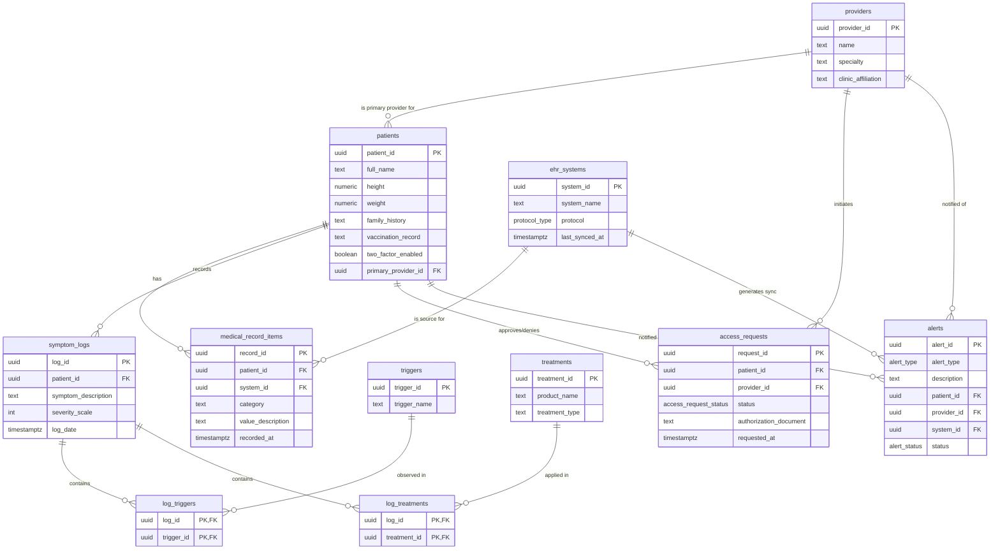
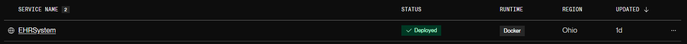
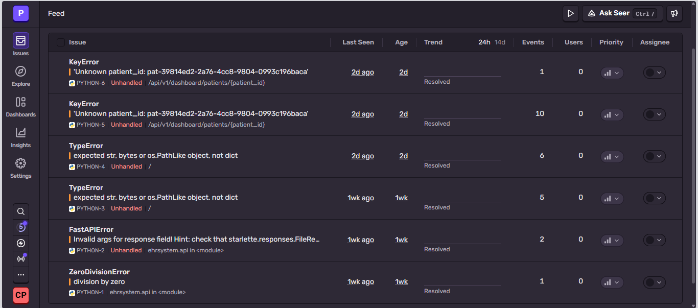
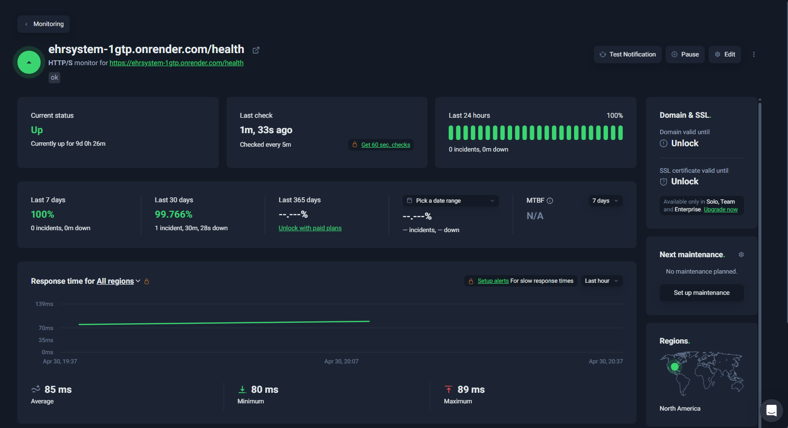

# EHRSystem
Patient Health Record (EHR) System for Chronic Disease Management in a Small Outpatient Clinic

The rising prevalence of chronic diseases and official diagnoses makes long-term treatment and management outside of hospitals critical. However, it is a challenge to remember all of the healthcare providers involved in chronic disease management, especially for those with multiple diagnoses. This web application presents a platform for both patients, their caregivers, and their healthcare providers to store and access patient information, demographics, medical history, diagnostics, prescriptions, and treatment plans, regardless of whether hospitals use large-scale EHR systems like Epic, Oracle Cerner, athenahealth, and NextGen. A critical aspect of this application would be updating patient information databases both at small clinics and at hospitals that use these large-scale EHR system, similar to updating remote and local repositories of GitHub.

---

# Logical Data Design

---

# Render Host Link

https://ehrsystem-1gtp.onrender.com/

---

# Render, Sentry, UpTimeRobot Screenshots

